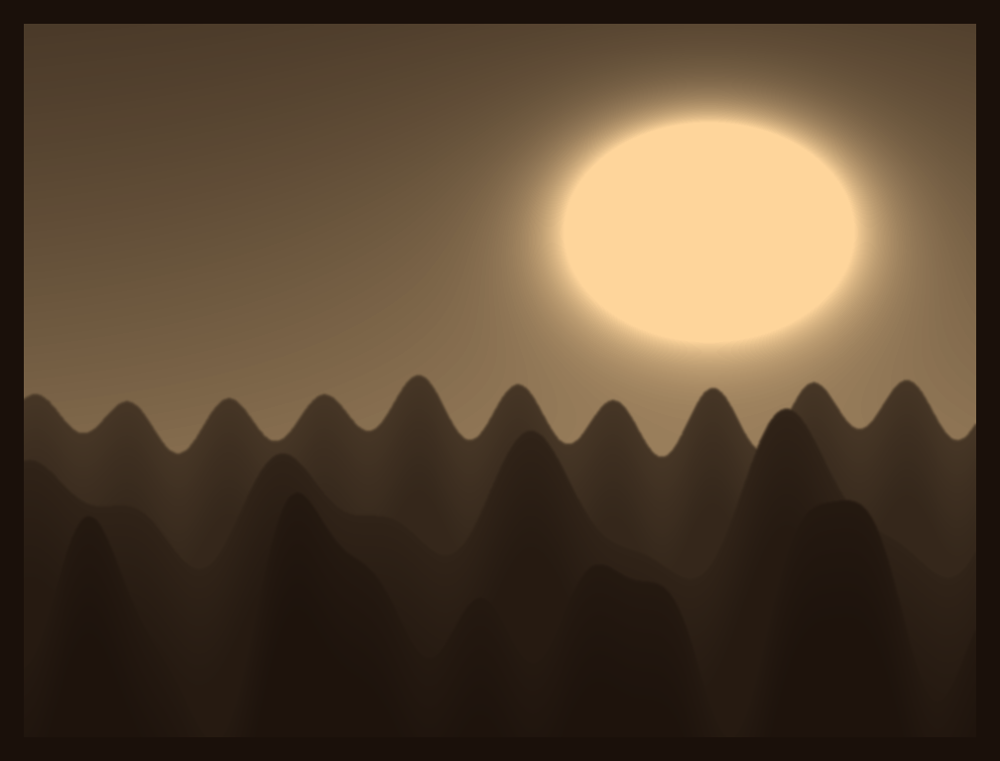

# photo-to-resin

Zamień zwykłe zdjęcie w **litofan** — cienką płytkę żywicy, na której obraz
pojawia się dopiero pod światło. Na wejściu JPG/PNG, na wyjściu binarny STL
gotowy do slicera drukarki żywicznej (Lychee, Chitubox).



## Jak to działa

1. **Jasność staje się grubością** — każdy piksel dostaje grubość żywicy:
   ciemne miejsca grubsze (przepuszczają mniej światła), jasne cieńsze.
2. **Mapa wysokości staje się bryłą** — szczelna siatka: rzeźbiona
   powierzchnia, płaski spód, domknięte ścianki, opcjonalna ramka.
3. **Bryła staje się plikiem STL** — binarny STL z wymiarami w milimetrach.

## Instalacja

```bash
git clone https://github.com/arturskowronski/photo-to-resin
cd photo-to-resin
pip install -e .            # sama biblioteka + CLI
pip install -e ".[notebook]"  # z interfejsem dla Jupytera
```

## Interfejs w Jupyterze

Panel z suwakami, podglądem podświetlenia na żywo (symulacja transmisji
światła) i szacunkiem rozmiaru pliku przed generowaniem:

```bash
jupyter lab notebooks/interfejs.ipynb
```

albo w dowolnym notebooku:

```python
from photo_to_resin.notebook import launch
launch()
```

## Z wiersza poleceń

```bash
photo-to-resin zdjecie.jpg -o litofan.stl --width 80 --resolution 4
```

## Z kodu

```python
from photo_to_resin import LithophaneParams, photo_to_stl

params = LithophaneParams(width_mm=80, min_thickness_mm=0.6, max_thickness_mm=2.8)
photo_to_stl("zdjecie.jpg", "litofan.stl", params)
```

## Pipeline figurkowy (demo DziadkoDruk)

Pełne przejście "zdjęcie → figurka do druku" w dwóch skryptach:

```bash
# etap 1-2: syntetyczne zdjęcie demo + stylizowana wizualizacja figurki
# (gpt-image-1; wymaga OPENAI_API_KEY)
.venv/bin/python scripts/figurki_pipeline.py

# etap 3-4: geometria 3D (image-to-3D), STL ~90 mm i rendery
# silnik Tripo API (jakość SoTA; wymaga TRIPO_API_KEY i kredytów API):
FIGURKI_ENGINE=tripo python scripts/figurki_3d.py
# albo lokalny TripoSR (bez klucza, słabsza jakość):
TRIPOSR_DIR=<klon TripoSR> TRIPOSR_DEVICE=mps python scripts/figurki_3d.py
```

Wyniki trafiają do `site/figurki/` i zasilają sekcję "Figurki" na stronie.
Demo nie używa prawdziwych zdjęć — wejścia też są generowane. Modele Tripo
składają się z dziesiątek otwartych powłok, więc pipeline przebudowuje je
w jedną szczelną bryłę (pole odległości + marching cubes), a pobrane GLB
trafiają do `.cache/figurki/`, żeby nie płacić dwa razy za tę samą scenę.

## Galeria przykładów

Pięć scen przechodzi cały pipeline end-to-end (zdjęcie → notebook → STL →
renderingi) w `notebooks/przyklady.ipynb`; wyniki lądują w `site/przyklady/`
i zasilają sekcję "Przykłady" na stronie:

```bash
jupyter nbconvert --to notebook --execute --inplace notebooks/przyklady.ipynb
```

## Strona

Statyczna strona reklamowa leży w `site/` — grafiki na niej są prawdziwym
outputem biblioteki (`scripts/make_site_assets.py`). Podgląd lokalnie:

```bash
python3 -m http.server -d site 8741
```

## Wskazówki do druku

- Żywica mleczna lub jasnoszara daje najlepszy kontrast; czarna nie przepuszcza światła.
- Grubość 0.6–2.8 mm to sprawdzony zakres; poniżej 0.4 mm robi się kruche.
- Rozdzielczość 4 px/mm wystarcza — drukarka i tak wygładzi detal, a plik nie puchnie.
- Drukuj płytkę pionowo lub pod kątem, gładką stroną (spodem) do LCD.

## Testy

```bash
python3 tests/test_core.py
```

Testy sprawdzają m.in. szczelność siatki (każda krawędź w dokładnie dwóch
trójkątach) i zgodność objętości bryły z całką z mapy wysokości.

## Licencja

MIT
